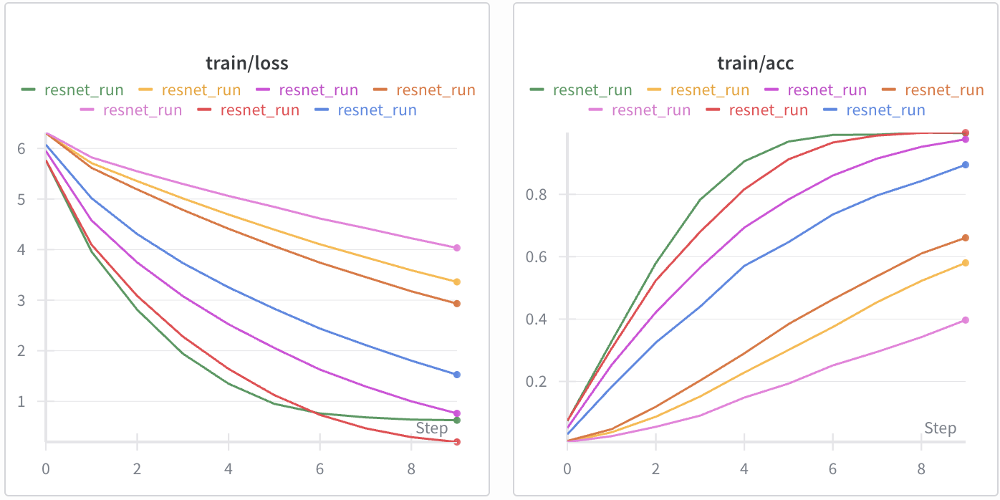
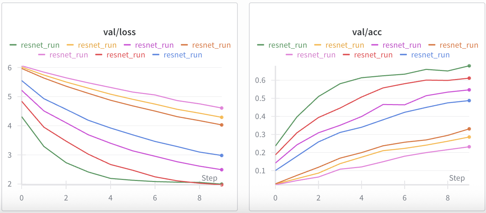
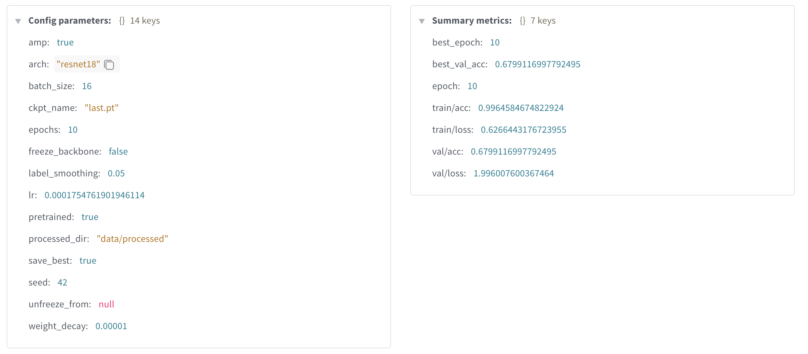
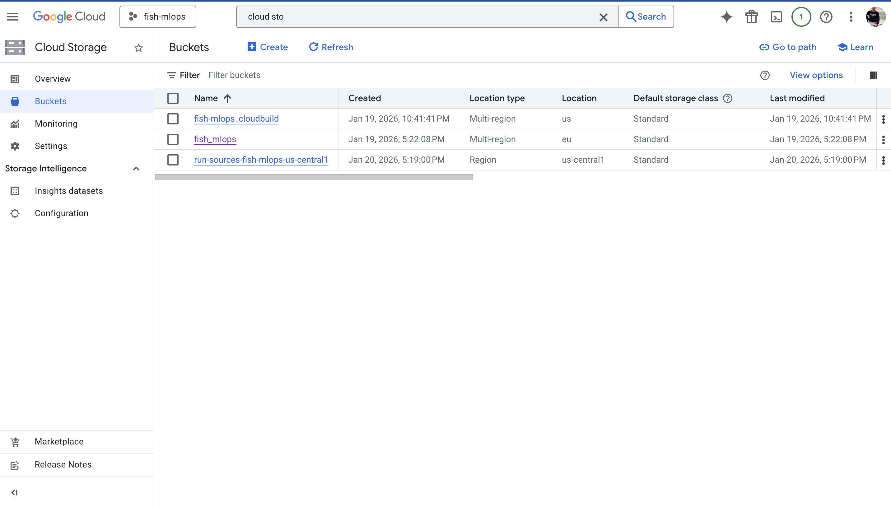
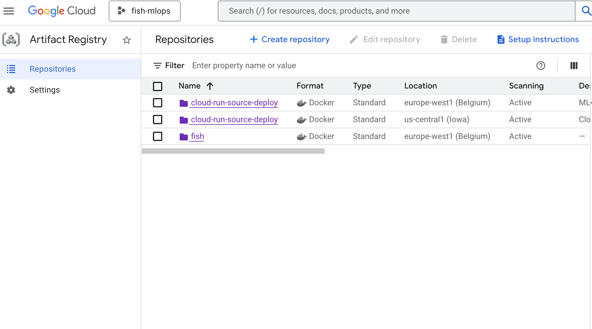
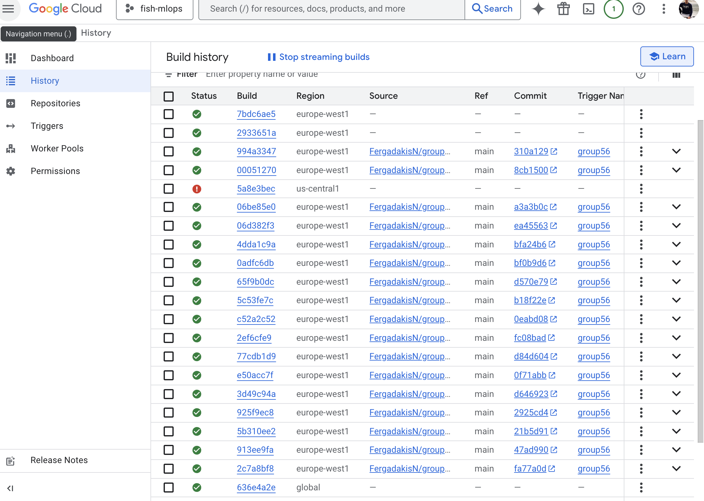
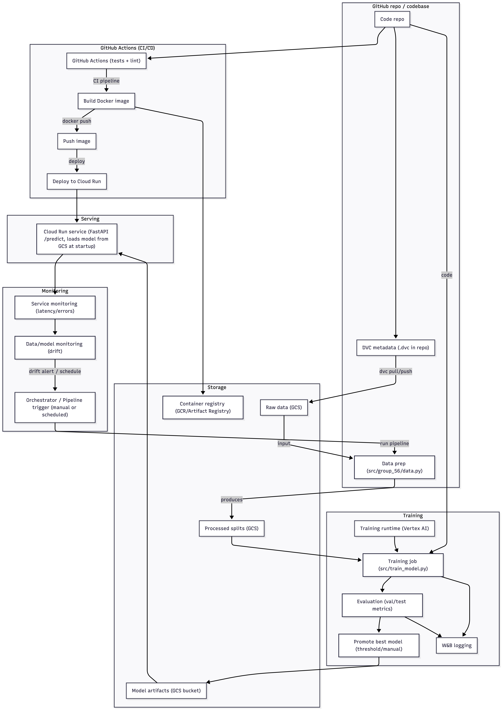

# Exam template for 02476 Machine Learning Operations

This is the report template for the exam. Please only remove the text formatted as with three dashes in front and behind
like:

`--- question 1 fill here ---`

Where you instead should add your answers. Any other changes may have unwanted consequences when your report is
auto-generated at the end of the course. For questions where you are asked to include images, start by adding the image
to the `figures` subfolder (please only use `.png`, `.jpg` or `.jpeg`) and then add the following code in your answer:

``

In addition to this markdown file, we also provide the `report.py` script that provides two utility functions:

Running:

```bash
python report.py html
```

Will generate a `.html` page of your report. After the deadline for answering this template, we will auto-scrape
everything in this `reports` folder and then use this utility to generate a `.html` page that will be your serve
as your final hand-in.

Running

```bash
python report.py check
```

Will check your answers in this template against the constraints listed for each question e.g. is your answer too
short, too long, or have you included an image when asked. For both functions to work you mustn't rename anything.
The script has two dependencies that can be installed with

```bash
pip install typer markdown
```

or

```bash
uv add typer markdown
```

## Overall project checklist

The checklist is _exhaustive_ which means that it includes everything that you could do on the project included in the
curriculum in this course. Therefore, we do not expect at all that you have checked all boxes at the end of the project.
The parenthesis at the end indicates what module the bullet point is related to. Please be honest in your answers, we
will check the repositories and the code to verify your answers.

### Week 1

- [x] Create a git repository (M5)
- [x] Make sure that all team members have write access to the GitHub repository (M5)
- [x] Create a dedicated environment for you project to keep track of your packages (M2)
- [x] Create the initial file structure using cookiecutter with an appropriate template (M6)
- [x] Fill out the `data.py` file such that it downloads whatever data you need and preprocesses it (if necessary) (M6)
- [x] Add a model to `model.py` and a training procedure to `train.py` and get that running (M6)
- [x] Remember to either fill out the `requirements.txt`/`requirements_dev.txt` files or keeping your
      `pyproject.toml`/`uv.lock` up-to-date with whatever dependencies that you are using (M2+M6)
- [x] Remember to comply with good coding practices (`pep8`) while doing the project (M7)
- [x] Do a bit of code typing and remember to document essential parts of your code (M7)
- [x] Setup version control for your data or part of your data (M8)
- [x] Add command line interfaces and project commands to your code where it makes sense (M9)
- [x] Construct one or multiple docker files for your code (M10)
- [x] Build the docker files locally and make sure they work as intended (M10)
- [x] Write one or multiple configurations files for your experiments (M11)
- [ ] Used Hydra to load the configurations and manage your hyperparameters (M11)
- [ ] Use profiling to optimize your code (M12)
- [x] Use logging to log important events in your code (M14)
- [x] Use Weights & Biases to log training progress and other important metrics/artifacts in your code (M14)
- [x] Consider running a hyperparameter optimization sweep (M14)
- [ ] Use PyTorch-lightning (if applicable) to reduce the amount of boilerplate in your code (M15)

### Week 2

- [x] Write unit tests related to the data part of your code (M16)
- [x] Write unit tests related to model construction and or model training (M16)
- [x] Calculate the code coverage (M16)
- [x] Get some continuous integration running on the GitHub repository (M17)
- [x] Add caching and multi-os/python/pytorch testing to your continuous integration (M17)
- [x] Add a linting step to your continuous integration (M17)
- [x] Add pre-commit hooks to your version control setup (M18)
- [x] Add a continues workflow that triggers when data changes (M19)
- [x] Add a continues workflow that triggers when changes to the model registry is made (M19)
- [x] Create a data storage in GCP Bucket for your data and link this with your data version control setup (M21)
- [x] Create a trigger workflow for automatically building your docker images (M21)
- [x] Get your model training in GCP using either the Engine or Vertex AI (M21)
- [x] Create a FastAPI application that can do inference using your model (M22)
- [x] Deploy your model in GCP using either Functions or Run as the backend (M23)
- [x] Write API tests for your application and setup continues integration for these (M24)
- [x] Load test your application (M24)
- [ ] Create a more specialized ML-deployment API using either ONNX or BentoML, or both (M25)
- [ ] Create a frontend for your API (M26)

### Week 3

- [x] Check how robust your model is towards data drifting (M27)
- [x] Setup collection of input-output data from your deployed application (M27)
- [x] Deploy to the cloud a drift detection API (M27)
- [x] Instrument your API with a couple of system metrics (M28)
- [x] Setup cloud monitoring of your instrumented application (M28)
- [x] Create one or more alert systems in GCP to alert you if your app is not behaving correctly (M28)
- [ ] If applicable, optimize the performance of your data loading using distributed data loading (M29)
- [ ] If applicable, optimize the performance of your training pipeline by using distributed training (M30)
- [ ] Play around with quantization, compilation and pruning for you trained models to increase inference speed (M31)

### Extra

- [x] Write some documentation for your application (M32)
- [ ] Publish the documentation to GitHub Pages (M32)
- [x] Revisit your initial project description. Did the project turn out as you wanted?
- [x] Create an architectural diagram over your MLOps pipeline
- [x] Make sure all group members have an understanding about all parts of the project
- [x] Uploaded all your code to GitHub

## Group information

### Question 1

> **Enter the group number you signed up on <learn.inside.dtu.dk>**
>
> Answer:

--- group 56 ---

### Question 2

> **Enter the study number for each member in the group**
>
> Example:
>
> _sXXXXXX, sXXXXXX, sXXXXXX_
>
> Answer:

--- s252976, s253129, s243131, s253154 ---

### Question 3

> **Did you end up using any open-source frameworks/packages not covered in the course during your project? If so**
> **which did you use and how did they help you complete the project?**
>
> Recommended answer length: 0-200 words.
>
> Example:
> _We used the third-party framework ... in our project. We used functionality ... and functionality ... from the_
> _package to do ... and ... in our project_.
>
> Answer:

--- No, we only used frameworks/packages mentioned in the course.---

## Coding environment

> In the following section we are interested in learning more about you local development environment. This includes
> how you managed dependencies, the structure of your code and how you managed code quality.

### Question 4

> **Explain how you managed dependencies in your project? Explain the process a new team member would have to go**
> **through to get an exact copy of your environment.**
>
> Recommended answer length: 100-200 words
>
> Example:
> _We used ... for managing our dependencies. The list of dependencies was auto-generated using ... . To get a_
> _complete copy of our development environment, one would have to run the following commands_
>
> Answer:

--- We managed dependencies using conda environments to ensure isolation and reproducibility across different machines. All required Python packages and their exact versions are listed in the requirements.txt file, allowing every team member to work with the same software setup and avoid dependency conflicts.
To obtain an exact copy of the project environment, a new team member must first clone the repository and move into the project directory. Then, a new conda environment is created to keep dependencies isolated from other projects. Once the environment is active, all necessary libraries are installed directly from the requirements.txt file using pip. The full process is shown below:
git clone [https://github.com/FergadakisN/group56.git](https://github.com/FergadakisN/group56.git)
cd group56
conda create -n myenv
conda activate myenv
pip install -r requirements.txt
Following these steps ensures that the development environment is fully reproducible and consistent across all team members and systems. ---

### Question 5

> **We expect that you initialized your project using the cookiecutter template. Explain the overall structure of your**
> **code. What did you fill out? Did you deviate from the template in some way?**
>
> Recommended answer length: 100-200 words
>
> Example:
> _From the cookiecutter template we have filled out the ... , ... and ... folder. We have removed the ... folder_
> _because we did not use any ... in our project. We have added an ... folder that contains ... for running our_
> _experiments._
>
> Answer:

--- The overall structure is initialized with the cookiecutter template. We tried to follow the cookiecutter structure as much as possible. The core code lives in src/group_56 (data loading/preprocessing in data.py, model definition in model.py, evaluation in evaluate.py, and the FastAPI app in api.py). Data is organized under data/ with raw/ and processed/ and tracked via DVC(data.dvc). Experiment configs live in configs/ (train+sweep configs), tests are in tests/ (unit,API, and load tests), and documentation in docs/ (mkdocs). We kept reports/ for the exam report and figures, and added infrastructure files such as dockerfiles/ for train/eval/api images,scripts/ for GCP monitoring setup, cloudbuild.yaml, config.yaml, and run outputs in outputs//wandb. We didn't do major deviations or removals from the template.We mainly extended it with extra configs and deployment/monitoring assets. ---

### Question 6

> **Did you implement any rules for code quality and format? What about typing and documentation? Additionally,**
> **explain with your own words why these concepts matters in larger projects.**
>
> Recommended answer length: 100-200 words.
>
> Example:
> _We used ... for linting and ... for formatting. We also used ... for typing and ... for documentation. These_
> _concepts are important in larger projects because ... . For example, typing ..._
>
> Answer:

--- In this project we followed code quality and formatting rules (PEP 8 style, consistent naming, docstrings, type hints, and organized imports) to keep the code readable. Ruff was used for both linting and formatting, while we used mypy to check typing. For documentation, we use module and function docstrings plus the project README/report to describe purpose and usage. Finally, we implemented automated ruff checks and ruff fixes using pre-commit configuration.
These concepts matter in larger projects because consistent style reduces cognitive load, catches bugs early, and makes code reviews faster. Typing is especially helpful when the team grows, because it clarifies inputs/outputs and prevents misuse across modules. Documentation preserves context, so new contributors can onboard quickly and changes are safer over time. Together, linting, formatting, typing, and docs create a shared standard that keeps the project maintainable and reliable. ---

## Version control

> In the following section we are interested in how version control was used in your project during development to
> corporate and increase the quality of your code.

### Question 7

> **How many tests did you implement and what are they testing in your code?**
>
> Recommended answer length: 50-100 words.
>
> Example:
> _In total we have implemented X tests. Primarily we are testing ... and ... as these the most critical parts of our_
> _application but also ... ._
>
> Answer:

--- In total we have implemented 5 tests in the test_data.py file, 9 in test_model.py, 13 in test_api.py, ... . In test_data.py we verify correct data preprocessing and dataloaders, including proper splitting, label alignment, valid tensor outputs, and absence of data leakage.
In test_model.py we test model construction, training logic, checkpointing, seeding, and validation metrics.
In test_api.py we validate the FastAPI endpoints, covering health checks, model loading, error handling, and prediction correctness.
... ---

### Question 8

> **What is the total code coverage (in percentage) of your code? If your code had a code coverage of 100% (or close**
> **to), would you still trust it to be error free? Explain you reasoning.**
>
> Recommended answer length: 100-200 words.
>
> Example:
> _The total code coverage of code is X%, which includes all our source code. We are far from 100% coverage of our \*_
> _code and even if we were then...\*_
>
> Answer:

--- The overall test coverage achieved in the project is 58%, as shown in the coverage report for the main source files in the src/group_56 directory. While this value does not reach full (100%) unit test coverage, it is important to emphasize that higher coverage alone does not guarantee correct or reliable software behavior. Code coverage only measures whether lines of code are executed during testing, not whether the underlying logic has been thoroughly validated.

Even with 100% coverage, tests may still be incomplete or misleading if they verify incorrect behavior, rely on weak assertions, or focus only on common execution paths while ignoring edge cases and failure scenarios. Conversely, some parts of the code—such as training loops, logging, or hardware-dependent logic—are difficult to test meaningfully with unit tests and may reasonably remain partially uncovered.

For these reasons, we treat coverage as a useful diagnostic metric rather than a correctness guarantee. It helps identify untested areas of the codebase, but confidence in correctness ultimately comes from a combination of well-designed tests, manual inspection, realistic validation experiments, and careful evaluation of model outputs. ---

### Question 9

> **Did you workflow include using branches and pull requests? If yes, explain how. If not, explain how branches and**
> **pull request can help improve version control.**
>
> Recommended answer length: 100-200 words.
>
> Example:
> _We made use of both branches and PRs in our project. In our group, each member had an branch that they worked on in_
> _addition to the main branch. To merge code we ..._
>
> Answer:

--- We made use of both brances and PRs in our project. In our group, each member had a branch that they worked on, in addition to the main branch. More specifically, we used a new branch for almost each new task we made. This let us review the code before we merged it,while keeping the main branch stable. PRs also provided a clear history of what changed and why, helping us avoiding conflicts. To merge code we opened a pull request from the feature branch into main, requested a quick review from a teammate, resolved any comments or conflicts, and only merged after CI/tests passed to keep the main branch stable ---

### Question 10

> **Did you use DVC for managing data in your project? If yes, then how did it improve your project to have version**
> **control of your data. If no, explain a case where it would be beneficial to have version control of your data.**
>
> Recommended answer length: 100-200 words.
>
> Example:
> _We did make use of DVC in the following way: ... . In the end it helped us in ... for controlling ... part of our_
> _pipeline_
>
> Answer:

--- We used DVC to version control the fish image dataset and related metadata files(e.g. the cropped images). Instead of commiting large files to Git, we tracked them with .dvc files and stored the actual data in a shared remote Google Drive. This made the repository lightweight, while still keeping exact dataset versions tied to specific commits. Also, it improved reproducibility, since anyone could pull the same dataset version that was used for training or evaluation. Moreover, it helped the team collaborate without manually sharing large files. Overall, DVC gave us a reliable way to manage and share data artifacts alongsie code, which kept the pipeline consistent and easier to debug. ---

### Question 11

> **Discuss you continuous integration setup. What kind of continuous integration are you running (unittesting,**
> **linting, etc.)? Do you test multiple operating systems, Python version etc. Do you make use of caching? Feel free**
> **to insert a link to one of your GitHub actions workflow.**
>
> Recommended answer length: 200-300 words.
>
> Example:
> _We have organized our continuous integration into 3 separate files: one for doing ..., one for running ... testing_
> _and one for running ... . In particular for our ..., we used ... .An example of a triggered workflow can be seen_
> _here: [weblink](weblink)_
>
> Answer:

--- Ecco una versione **allungata e più articolata**, intorno alle **200 parole**, mantenendo un tono tecnico e chiaro:

---

We have structured our continuous integration (CI) pipeline into two separate GitHub Actions workflows to clearly distinguish between code correctness and code quality checks. The first and main workflow, tests.yaml, is dedicated to running the unit test suite with coverage and is triggered on every push and pull request targeting the main branch. This workflow uses a matrix strategy that spans three operating systems—ubuntu-latest, windows-latest, and macos-latest —and two Python versions, 3.11 and 3.12. This setup allows us to proactively detect operating system–specific and Python version–specific issues, ensuring broad compatibility across environments.

Within each matrix job, dependencies are installed, the package is installed in editable mode, and unit tests are executed using pytest with coverage enabled. At the end of the run, coverage results are reported to provide visibility into test completeness. To keep CI runs deterministic and isolated, Weights & Biases (W&B) logging is explicitly disabled, preventing external network calls during automated testing. To improve performance, we leverage the pip caching mechanism provided by actions/setup-python, which significantly reduces runtime by reusing previously installed dependencies across jobs.

In addition to testing, we maintain a separate linting.yaml workflow focused on static analysis and formatting. This workflow runs ruff check and ruff format on ubuntu-latest, enforcing a consistent style and linting standard that matches our local development configuration. Together, these workflows ensure that every change is validated for both functional correctness and code quality before being merged.


An example workflow definition can be seen here: [tests.yaml](tests.yaml). ---

## Running code and tracking experiments

> In the following section we are interested in learning more about the experimental setup for running your code and
> especially the reproducibility of your experiments.

### Question 12

> **How did you configure experiments? Did you make use of config files? Explain with coding examples of how you would**
> **run a experiment.**
>
> Recommended answer length: 50-100 words.
>
> Example:
> _We used a simple argparser, that worked in the following way: Python my_script.py --lr 1e-3 --batch_size 25_
>
> Answer:

---
We configure experiments using JSON configuration files and W&B sweeps to ensure reproducibility and systematic exploration. Training parameters such as the number of epochs, batch size, learning rate, and weight decay can be overridden by passing a configuration file through the --config-path argument when launching training. For hyperparameter optimization, we define a sweep configuration in a dedicated YAML file and run it using Weights & Biases sweeps and agents. This approach ensures that all experiments are fully reproducible and automatically logged, with the exact configuration of each run stored and easily comparable at a later stage.
---

### Question 13

> **Reproducibility of experiments are important. Related to the last question, how did you secure that no information**
> **is lost when running experiments and that your experiments are reproducible?**
>
> Recommended answer length: 100-200 words.
>
> Example:
> _We made use of config files. Whenever an experiment is run the following happens: ... . To reproduce an experiment_
> _one would have to do ..._
>
> Answer:

--- We ensure full reproducibility throughout the project by combining fixed random seeds, version-controlled configuration files, and systematic experiment tracking. All training runs explicitly set random seeds for Python, NumPy, and PyTorch, ensuring deterministic behavior whenever possible. Hyperparameters and training options are stored in JSON configuration files and sweep definitions, which are tracked in version control and passed directly to the training script.
In addition, every experiment is logged to Weights & Biases, where the complete configuration, training and validation metrics, and relevant artifacts such as model checkpoints are automatically recorded. Checkpoints and detailed training logs are also saved locally on a per-run basis. This setup makes each experiment fully traceable and reproducible: any run can be rerun exactly by reusing the same configuration file and seed, or by restoring the precise run configuration directly from W&B for further analysis or comparison. ---

### Question 14

> **Upload 1 to 3 screenshots that show the experiments that you have done in W&B (or another experiment tracking**
> **service of your choice). This may include loss graphs, logged images, hyperparameter sweeps etc. You can take**
> **inspiration from [this figure](figures/wandb.png). Explain what metrics you are tracking and why they are**
> **important.**
>
> Recommended answer length: 200-300 words + 1 to 3 screenshots.
>
> Example:
> _As seen in the first image when have tracked ... and ... which both inform us about ... in our experiments._
> _As seen in the second image we are also tracking ... and ..._
>
> Answer:

---





The screenshots show several experiments tracked using Weights & Biases (W&B), where we monitored the evolution of training loss, training accuracy, validation loss, and validation accuracy over multiple epochs. These metrics are fundamental for understanding both how well the model fits the training data and how effectively it generalizes to unseen samples.

The training loss curves consistently decrease across all runs, indicating that the optimization process is working as expected and that the model is learning meaningful representations from the data. This is reflected in the training accuracy, which increases steadily and, in some runs, reaches relatively high values. Together, these metrics confirm that the model can successfully learn the training distribution.

To evaluate generalization performance, we also track validation loss and validation accuracy. These metrics are particularly important, as they provide an estimate of how the model would perform on new, unseen data. While validation loss decreases over time and validation accuracy improves, both metrics consistently lag behind their training counterparts. The visible gap between training and validation curves suggests the presence of overfitting, where the model fits the training data more closely than the validation data.

By logging multiple runs on the same plots, W&B allows direct comparison between different hyperparameter configurations, such as learning rate, batch size, or regularization strength. This makes it easier to identify training setups that lead to more stable convergence and better validation performance. Overall, tracking these four metrics provides a clear and interpretable overview of the learning dynamics and is essential for diagnosing overfitting and guiding further model improvements. ---

### Question 15

> **Docker is an important tool for creating containerized applications. Explain how you used docker in your**
> **experiments/project? Include how you would run your docker images and include a link to one of your docker files.**
>
> Recommended answer length: 100-200 words.
>
> Example:
> _For our project we developed several images: one for training, inference and deployment. For example to run the_
> _training docker image: `docker run trainer:latest lr=1e-3 batch_size=64`. Link to docker file: [weblink](weblink)_
>
> Answer:

--- For our project we used Docker to containerize both training and inference so experiments are reproducible and deployable. we built a training image from train.dockerfile and an API image from api.dockerfile. The training container runs the module entrypoint and expects the dataset to be available via DVC or a mounted volume.
commands:
docker build -t fish-train -f dockerfiles/train.dockerfile .
docker run --rm -v "$(pwd)/data:/app/data" fish-train --epochs 10 --batch-size 32
For inference, we run the FastAPI server:
docker build -t fish-api -f dockerfiles/api.dockerfile .
docker run --rm -p 8000:8080 fish-api

This setup let us share consistent environments across the team and made it straightforward to run locally, in CI, or on Cloud Run. Link to dockerfile:
[train.dockerfile](https://github.com/FergadakisN/group56/blob/main/dockerfiles/train.dockerfile)_
[api.dockerfile](https://github.com/FergadakisN/group56/blob/main/dockerfiles/api.dockerfile)_

---

### Question 16

> **When running into bugs while trying to run your experiments, how did you perform debugging? Additionally, did you**
> **try to profile your code or do you think it is already perfect?**
>
> Recommended answer length: 100-200 words.
>
> Example:
> _Debugging method was dependent on group member. Some just used ... and others used ... . We did a single profiling_
> _run of our main code at some point that showed ..._
>
> Answer:

--- We debugged experiments by combining fast feedback loops and structured logging. For most issues we reduced the run size (few epochs, small batch size, CPU) and reproduced errors locally, then used log statements and the training logs to trace where things broke. Unit tests for data and model components helped isolate bugs early, and API/load tests were used to catch deployment issues. When needed, we also relied on IDE breakpoints or simple print‑based checks of tensor shapes, dataloader outputs, and config values. W&B runs made it easy to spot abnormal metrics or NaNs. We did not run formal profiling tools (e.g., cProfile, torch profiler); the project isn’t “perfect,” and profiling would be the next step if we needed to optimize training time or data loading. ---

## Working in the cloud

> In the following section we would like to know more about your experience when developing in the cloud.

### Question 17

> **List all the GCP services that you made use of in your project and shortly explain what each service does?**
>
> Recommended answer length: 50-200 words.
>
> Example:
> _We used the following two services: Engine and Bucket. Engine is used for... and Bucket is used for..._
>
> Answer:

--- We used several GCP services to cover the full MLOps workflow. Cloud Storage (GCS) served as the shared data and artifact store, allowing DVC to version the dataset and save model checkpoints. Vertex AI handled cloud training jobs so we could run experiments on managed compute (including GPUs when needed). Cloud Run hosted our FastAPI inference service as a serverless container with automatic scaling. Cloud Build automated container builds and deployments whenever the code changed. Artifact Registry stored Docker images built by Cloud Build. Finally, Cloud Monitoring and Cloud Logging provided operational visibility by capturing API metrics and logs and enabling alerting. Together, these services let us train, deploy, and monitor the model in a reproducible and scalable way. ---

### Question 18

> **The backbone of GCP is the Compute engine. Explained how you made use of this service and what type of VMs**
> **you used?**
>
> Recommended answer length: 100-200 words.
>
> Example:
> _We used the compute engine to run our ... . We used instances with the following hardware: ... and we started the_
> _using a custom container: ..._
>
> Answer:

--- Ecco una risposta **estesa a ~120–150 parole**, chiara e aderente alla traccia:

---

We made use of Google Cloud Compute Engine indirectly through Vertex AI custom training jobs, which abstract the management of virtual machines while still relying on Compute Engine as the underlying infrastructure. Instead of manually provisioning and maintaining VMs, we configured Vertex AI to spin up and manage the required Compute Engine instances for each training run.

Our training workflow was container-based: we built a custom Docker image from our train.dockerfile and stored it in Artifact Registry. This container encapsulates all dependencies and training logic, ensuring consistency across runs. Vertex AI then deployed this container on managed Compute Engine VMs, selecting appropriate machine types depending on the training configuration.

During execution, the training jobs accessed datasets stored in Google Cloud Storage, synchronized via DVC, and logged metrics, losses, and hyperparameters to Weights & Biases for experiment tracking. This setup allowed us to leverage the scalability and reliability of Compute Engine while avoiding low-level VM management, resulting in a reproducible and scalable training infrastructure.
 ---

### Question 19

> **Insert 1-2 images of your GCP bucket, such that we can see what data you have stored in it.**
> **You can take inspiration from [this figure](figures/bucket.png).**
>
> Answer:

---  ---

### Question 20

> **Upload 1-2 images of your GCP artifact registry, such that we can see the different docker images that you have**
> **stored. You can take inspiration from [this figure](figures/registry.png).**
>
> Answer:

---  ---

### Question 21

> **Upload 1-2 images of your GCP cloud build history, so we can see the history of the images that have been build in**
> **your project. You can take inspiration from [this figure](figures/build.png).**
>
> Answer:

---  ---

### Question 22

> **Did you manage to train your model in the cloud using either the Engine or Vertex AI? If yes, explain how you did**
> **it. If not, describe why.**
>
> Recommended answer length: 100-200 words.
>
> Example:
> _We managed to train our model in the cloud using the Engine. We did this by ... . The reason we choose the Engine_
> _was because ..._
>
> Answer:

--- We managed to train the model in the cloud using Vertex AI. We containerized the training code with our training Dockerfile, pushed the image to Artifact Registry, and submitted a Vertex AI custom training job pointing to that image. The job pulled the dataset from our GCS/DVC remote at runtime, ran the group_56.train module inside the container, and logged metrics to Weights & Biases for experiment tracking. We chose Vertex AI because it provides managed training infrastructure, easy access to GPU/CPU resources, and integrates well with other GCP services we already used (GCS, Artifact Registry, Cloud Build). This setup kept the training environment reproducible and allowed us to scale runs beyond our local machines. ---

## Deployment

### Question 23

> **Did you manage to write an API for your model? If yes, explain how you did it and if you did anything special. If**
> **not, explain how you would do it.**
>
> Recommended answer length: 100-200 words.
>
> Example:
> _We did manage to write an API for our model. We used FastAPI to do this. We did this by ... . We also added ..._
> _to the API to make it more ..._
>
> Answer:

--- We did manage to write an API for our model. We used FastAPI to create a comprehensive REST API for the fish species classifier. The API includes several key endpoints: /predict for image classification, /health for status checks, /model/info for model metadata, and /metrics for Prometheus metrics. The API accepts image uploads via multipart form data and returns predictions with confidence scores and top-k predictions. We also implemented Prometheus metrics to track request counts, error rates, and prediction latency, which enables monitoring and performance analysis. The API uses background tasks to log predictions and extracted features to a CSV database for data drift detection and analysis. ---

### Question 24

> **Did you manage to deploy your API, either in locally or cloud? If not, describe why. If yes, describe how and**
> **preferably how you invoke your deployed service?**
>
> Recommended answer length: 100-200 words.
>
> Example:
> _For deployment we wrapped our model into application using ... . We first tried locally serving the model, which_
> _worked. Afterwards we deployed it in the cloud, using ... . To invoke the service an user would call_
> _`curl -X POST -F "file=@file.json"<weburl>`_
>
> Answer:

--- We deployed the API both locally and attempted cloud deployment. Locally, the API runs successfully using FastAPI/Uvicorn within a Docker container. For cloud deployment, we containerized the API using a Cloud Run-optimized Dockerfile and pushed it to GCP Artifact Registry. However, due to permission and authentication issues with GCP service accounts and Cloud Run configuration, the full production deployment encountered challenges. Users can invoke the local service with: `curl -X POST http://localhost:8000/predict -F "file=@fish.jpg`. For the intended cloud deployment, requests would be sent to the Cloud Run service URL in the same format. The API automatically downloads the latest model checkpoint from GCS on startup if deployed to the cloud. ---

### Question 25

> **Did you perform any unit testing and load testing of your API? If yes, explain how you did it and what results for**
> **the load testing did you get. If not, explain how you would do it.**
>
> Recommended answer length: 100-200 words.
>
> Example:
> _For unit testing we used ... and for load testing we used ... . The results of the load testing showed that ..._
> _before the service crashed._
>
> Answer:

--- We performed both unit testing and load testing of the API. For unit testing, we used pytest with 13 test cases covering health checks, model loading, invalid inputs, prediction endpoints, and response validation. The tests verify endpoint correctness, error handling, and prediction consistency. For load testing, we used Locust to simulate concurrent users and traffic patterns against the API. We defined three user profiles: FishClassifierUser for normal traffic patterns, StressTestUser for high-load scenarios with short wait times, and SpikeTestUser for burst traffic. The load tests showed that the API handled moderate concurrent load well, with latencies typically under 500ms, but under extreme stress (many concurrent requests) some degradation occurred, demonstrating the need for appropriate resource allocation and autoscaling. ---

### Question 26

> **Did you manage to implement monitoring of your deployed model? If yes, explain how it works. If not, explain how**
> **monitoring would help the longevity of your application.**
>
> Recommended answer length: 100-200 words.
>
> Example:
> _We did not manage to implement monitoring. We would like to have monitoring implemented such that over time we could_
> _measure ... and ... that would inform us about this ... behaviour of our application._
>
> Answer:

--- We implemented comprehensive monitoring of the deployed API. On the application layer, we instrumented the API with Prometheus metrics including fish_api_requests_total (request counts), fish_api_errors_total (error tracking), and fish_api_prediction_latency_seconds (latency histograms). These metrics are exposed on the /metrics endpoint. We also implemented data drift detection by extracting image features (brightness, contrast, sharpness, color statistics) and logging predictions to a CSV database for monitoring input distribution changes. A /monitoring endpoint provides drift analysis reports. On the infrastructure layer, we set up GCP Cloud Monitoring dashboards and configured alert policies using a setup script that monitors CPU usage, memory consumption, and error rates. Monitoring helps ensure long-term reliability by detecting performance degradation, service anomalies, data drift, and resource exhaustion, enabling proactive intervention before issues impact users. ---

## Overall discussion of project

> In the following section we would like you to think about the general structure of your project.

### Question 27

> **How many credits did you end up using during the project and what service was most expensive? In general what do**
> **you think about working in the cloud?**
>
> Recommended answer length: 100-200 words.
>
> Example:
> _Group member 1 used ..., Group member 2 used ..., in total ... credits was spend during development. The service_
> _costing the most was ... due to ... . Working in the cloud was ..._
>
> Answer:

--- All group members were able to complete the project without using any paid credits, as we consistently relied on free-tier resources provided by Google Cloud. While this allowed us to stay within the available limits, working with the cloud environment proved to be somewhat challenging. In particular, the Google Cloud Console was not always intuitive or user-friendly, especially for users with limited prior experience. Setting up the infrastructure required managing a large number of permissions, service accounts, and IAM roles, as well as configuring IDs, secrets, and environment variables. Additionally, we had to enable and configure several features that were not explicitly covered during the lectures, which increased the overall complexity. Despite our efforts, not all components worked seamlessly in the end, and we continued to encounter persistent permission-related issues, especially when deploying and running services through Cloud Run.
 ---

### Question 28

> **Did you implement anything extra in your project that is not covered by other questions? Maybe you implemented**
> **a frontend for your API, use extra version control features, a drift detection service, a kubernetes cluster etc.**
> **If yes, explain what you did and why.**
>
> Recommended answer length: 0-200 words.
>
> Example:
> _We implemented a frontend for our API. We did this because we wanted to show the user ... . The frontend was_
> _implemented using ..._
>
> Answer:

--- No we didn't implement something extra on the project that is not covered by other questions. ---

### Question 29

> **Include a figure that describes the overall architecture of your system and what services that you make use of.**
> **You can take inspiration from [this figure](figures/overview.png). Additionally, in your own words, explain the**
> **overall steps in figure.**
>
> Recommended answer length: 200-400 words
>
> Example:
>
> _The starting point of the diagram is our local setup, where we integrated ... and ... and ... into our code._
> _Whenever we commit code and push to GitHub, it auto triggers ... and ... . From there the diagram shows ..._
>
> Answer:

--- The overall architecture of our system can be describe by . The diagram summarizes our end‑to‑end MLOps workflow. The starting point is the GitHub repository where all code, configuration, and DVC metadata live. When code is pushed, GitHub Actions runs CI (tests, linting/formatting) to enforce correctness and quality. The same CI/CD pipeline builds a Docker image, pushes it to Artifact Registry, and deploys the updated service to Cloud Run.

Data is versioned with DVC: the .dvc metadata in the repo points to a GCS bucket that stores the raw images and the processed splits. Data preparation (data.py) pulls raw data, performs filtering/splitting, and writes processed splits back to GCS. Training runs on Vertex AI using the training script, reads the processed data, and logs metrics to W&B. Evaluation is performed on validation/test splits, and only models that pass the promotion criteria are stored as artifacts in a dedicated GCS bucket.

Serving is handled by a FastAPI app running on Cloud Run. At startup, the service downloads the latest promoted model artifact from GCS and loads it into memory for inference. Monitoring is split into service monitoring (latency/errors) and model/data monitoring (drift). A drift or schedule event triggers an orchestrator step (manual or scheduled), which reruns the data pipeline and training to refresh the model. Overall, the system provides a reproducible path from data and code changes to training, evaluation, deployment, and monitored inference in production. ---

### Question 30

> **Discuss the overall struggles of the project. Where did you spend most time and what did you do to overcome these**
> **challenges?**
>
> Recommended answer length: 200-400 words.
>
> Example:
> _The biggest challenges in the project was using ... tool to do ... . The reason for this was ..._
>
> Answer:

--- Throughout the project, we encountered several challenges that significantly slowed down development and required iterative problem solving. At the outset, one of the main difficulties was determining the appropriate placement for each function and code snippet within the project structure. Since we were not initially familiar with working in a modular, production-style codebase, adapting to a structured project layout proved challenging and caused early delays.

As development progressed, we faced additional issues related to data handling. In particular, generating consistent dataset splits and implementing correct preprocessing pipelines required careful consideration. Managing the data lifecycle as a whole was also non-trivial, especially when deciding which artifacts should be tracked using DVC. Ensuring that training, validation, and test sets remained consistent and reproducible across different environments became a central concern.

One of the most significant obstacles involved accessing and using DVC reliably across the team. Configuring DVC with a Google Cloud Storage (GCS) remote proved more complex than expected, primarily due to permission and authentication issues. Service account credentials, bucket access rights, and inconsistent local configurations frequently caused authorization failures or prevented team members from pulling or pushing data. These issues made collaborative data access difficult and required multiple rounds of debugging and reconfiguration.

In addition, integrating cloud-based training and deployment components introduced further complexity. The Vertex AI training environment needed seamless access to the same DVC remote, model artifacts had to be saved correctly to GCS, and the Cloud Run inference service had to load the appropriate model versions. Differences between local and cloud environments—such as missing permissions, misconfigured service accounts, or unavailable files inside containers—led to subtle errors that did not appear during local execution.

To overcome these challenges, we standardized directory structures, clearly documented the storage and bucket layout, and unified DVC configuration and access policies across the team. We validated permissions and connectivity using minimal test commands before running full training jobs and relied on logging and GitHub Actions to reproduce errors efficiently. Once DVC access, storage paths, and cloud permissions were stabilized, the pipeline became significantly more reliable, allowing us to focus on improving model performance and deployment quality. ---

### Question 31

> **State the individual contributions of each team member. This is required information from DTU, because we need to**
> **make sure all members contributed actively to the project. Additionally, state if/how you have used generative AI**
> **tools in your project.**
>
> Recommended answer length: 50-300 words.
>
> Example:
> _Student sXXXXXX was in charge of developing of setting up the initial cookie cutter project and developing of the_
> _docker containers for training our applications._
> _Student sXXXXXX was in charge of training our models in the cloud and deploying them afterwards._
> _All members contributed to code by..._
> _We have used ChatGPT to help debug our code. Additionally, we used GitHub Copilot to help write some of our code._
> Answer:

--- All team members contributed actively and equally to the project, both in terms of workload and engagement. While specific responsibilities were divided to ensure efficiency, all major design decisions, debugging sessions, and conceptual questions were discussed collaboratively, and we regularly reviewed and improved each other’s work.

Student s252976 focused primarily on the model development and training pipeline, including transfer learning with ResNet architectures, training logic, hyperparameter tuning  and unit testing.

Student s253154 was responsible for setting up continuous integration (GitHub Actions for tests/linting, OS/Python matrix, caching) and for creating the overall MLOps architecture diagram.

Student s253129 was responsible for data versioning and cloud storage, including configuring DVC, managing the Google Cloud Storage backend, and resolving access and permission issues related to shared data artifacts.

Student s243131 focused primarily on API development and deployment, implementing the inference API and integrating it with the trained models for serving. Help generally assembling all the components together for the pipeline and generally managed the branches on Github.

Despite this division of responsibilities, all team members actively reviewed pull requests, suggested improvements, and contributed fixes across all parts of the codebase. Troubleshooting, architectural decisions, and conceptual questions were typically addressed together as a group to ensure shared understanding and consistency.

Regarding the use of generative AI tools, we used them as a support tool primarily for clarifying concepts, improving code readability and debugging, and refining documentation and report text. All design choices, implementation details, and final code were critically reviewed and adapted by the team to ensure correctness and alignment with course requirements. ---
